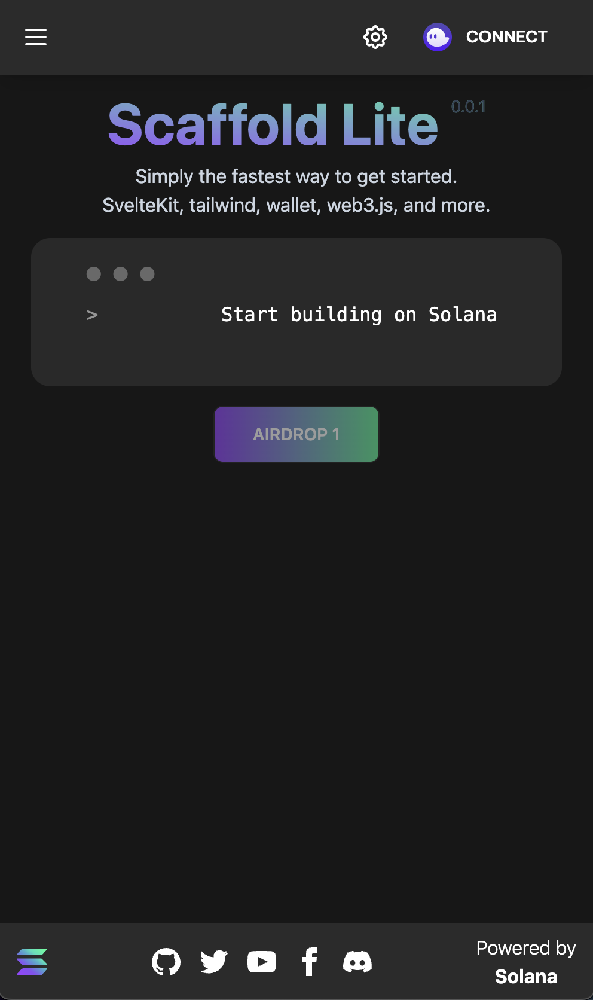
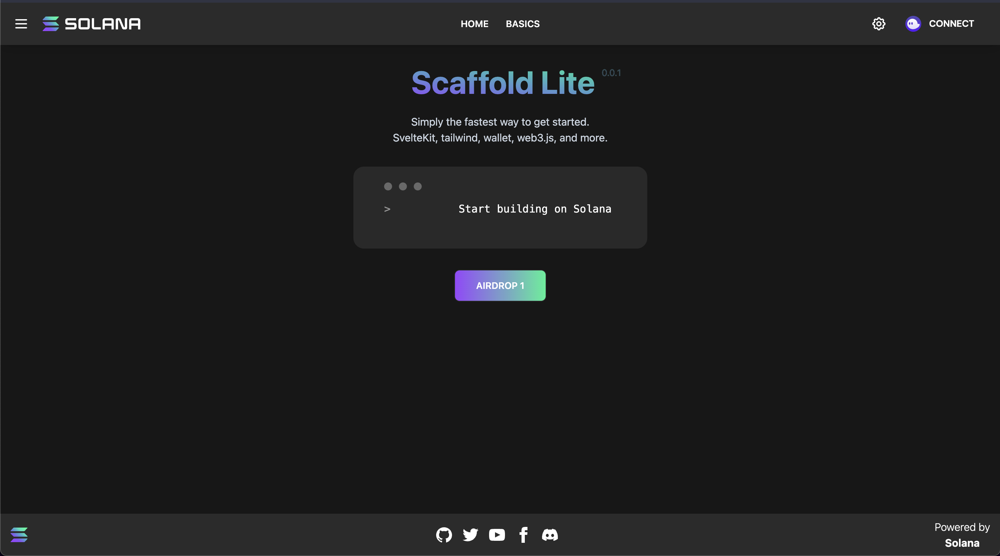

# Dapp Scaffold Svelte

This is a [`SvelteKit`](https://kit.svelte.dev/) project powered by [`create-svelte`](https://github.com/sveltejs/kit/tree/master/packages/create-svelte) to create Solana Dapps based on Svelte.

Responsive                     |  Desktop
:-------------------------:|:-------------------------:
  |  

It is using the [`svelte-wallet-adapter`](https://github.com/svelte-on-solana/wallet-adapter) to integrate wallets, and [`tailwindcss`](https://tailwindcss.com/) and [`daisyui`](https://daisyui.com/) for styling.

## Installation

```bash
npm install
# or
yarn install
```

## Developing


```bash
npm run dev

# or start the server and open the app in a new browser tab
npm run dev -- --open
```

## Building

To create a production version of your app:

```bash
npm run build
```

You can preview the production build with `npm run preview`.

> To deploy your app, you may need to install an [adapter](https://kit.svelte.dev/docs/adapters) for your target environment.

## References

This scaffold references features and styling from the original [Next.js scaffold](https://github.com/solana-labs/dapp-scaffold)
